# TIME-SERIES ANALYSIS
MAHALAKSHMI  


Loading the relevant R packages


Loading the relevant datasets


Converting data to Time series format


```
##  Time-Series [1:769] from 1948 to 2012: 51.6 50.7 47.7 49.4 50.6 ...
```

```
##  Time-Series [1:769] from 1948 to 2012: 33.9 34.3 34.5 34.4 34 ...
```
Exploring the summary statistics


```
##    Min. 1st Qu.  Median    Mean 3rd Qu.    Max. 
##   36.61   41.96   43.48   44.21   45.33   56.54
```

```
##    Min. 1st Qu.  Median    Mean 3rd Qu.    Max. 
##   32.83   35.22   36.35   36.54   37.71   42.24
```

Plotting the Time series behavior of the two data sets Mat1 and Mat2 with the regression line showing the general trend.The Mat1 data tends to be a lot more stationary showing no trend but MAt2 data shows an upward trend.

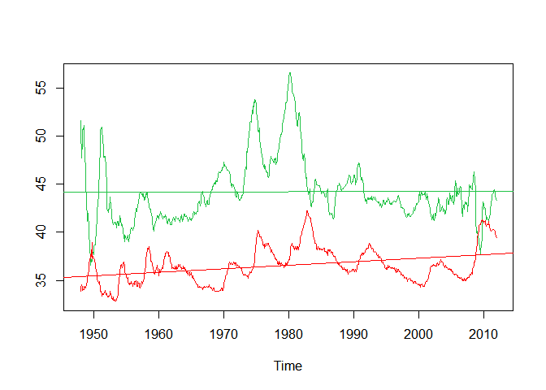<!-- -->

Showing the Decomposition plot

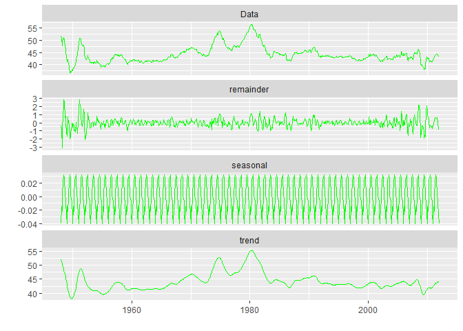<!-- -->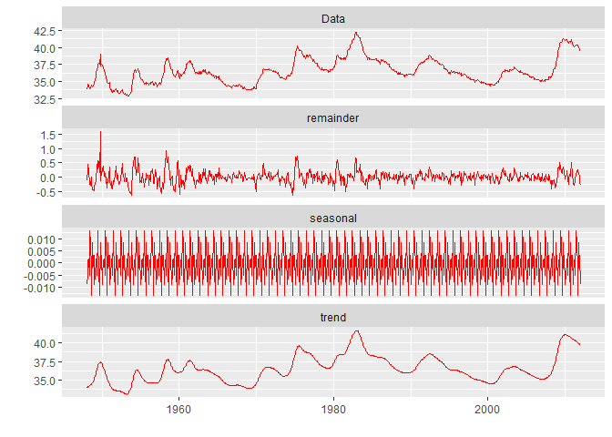<!-- -->

Plotting the ACF for both the data.
Looks like a gradual slowdown for both the data sets indicating a AR model

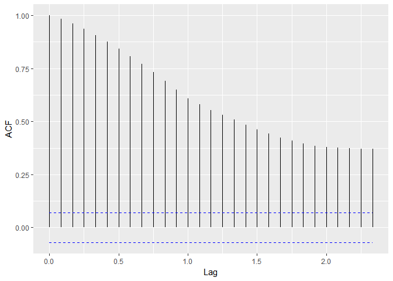<!-- -->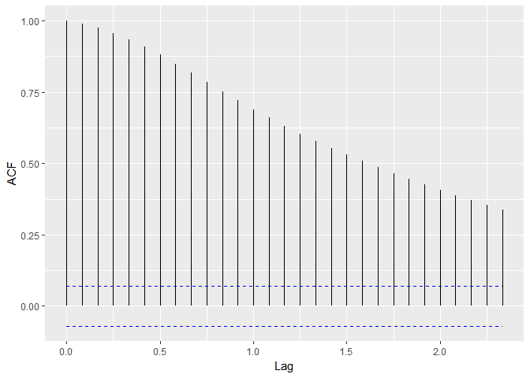<!-- -->

Taking the Differentiation and then the ACF shows a gradual slowdown.

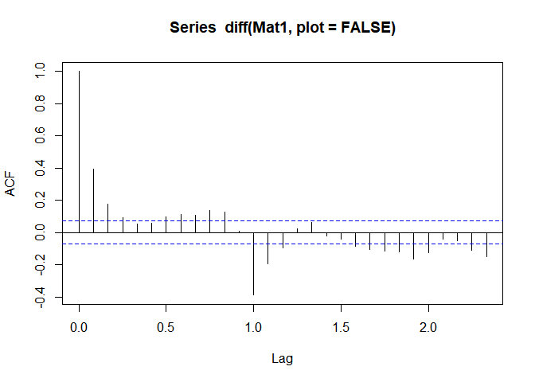<!-- -->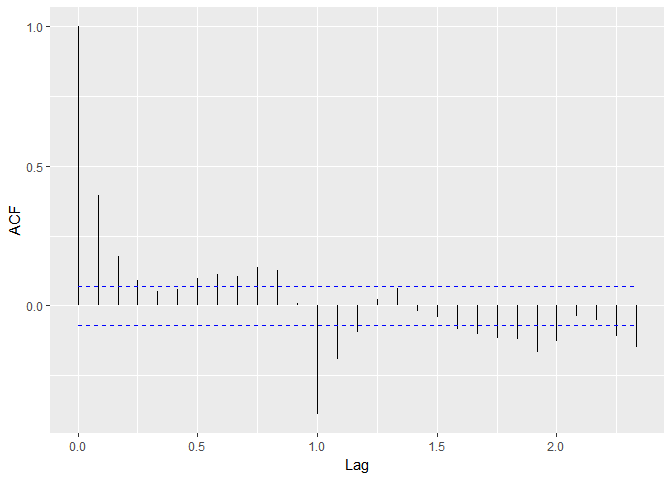<!-- -->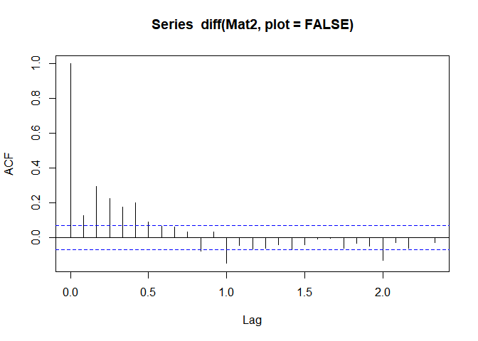<!-- -->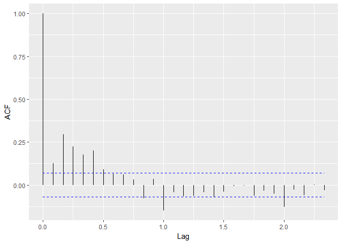<!-- -->

Taking the PACF to see if there is a cut off or a gradual slowdown.
The Plot shows a Gradual slowdown indicating a ARIMA model

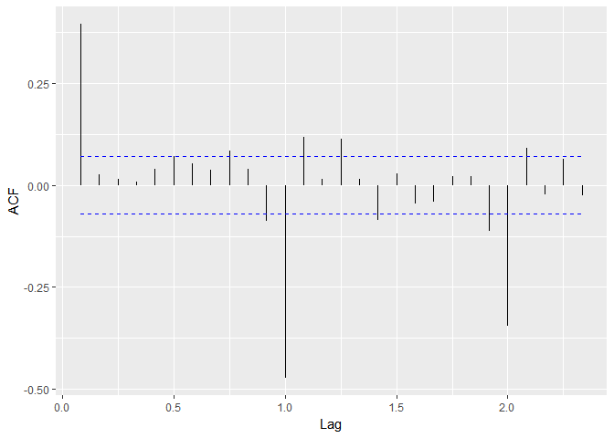<!-- -->

```
## 
## Call:
## arima(x = Mat1, order = c(2, 1, 2))
## 
## Coefficients:
##           ar1     ar2     ma1      ma2
##       -0.3358  0.4777  0.7764  -0.2236
## s.e.   0.0933  0.0731  0.1039   0.1037
## 
## sigma^2 estimated as 0.2193:  log likelihood = -509.16,  aic = 1028.31
```


Plotting the details of the ARIMA (2,1,2) model

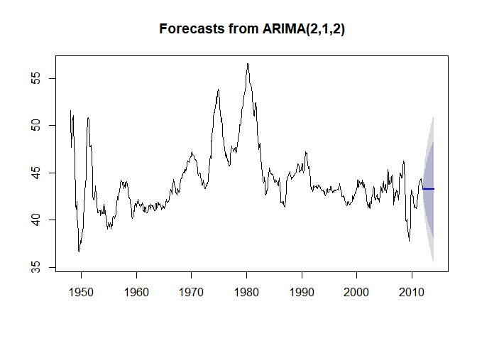<!-- -->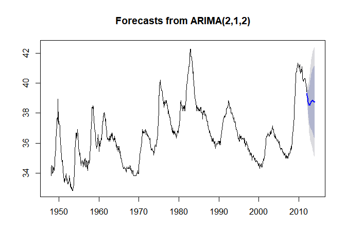<!-- -->

